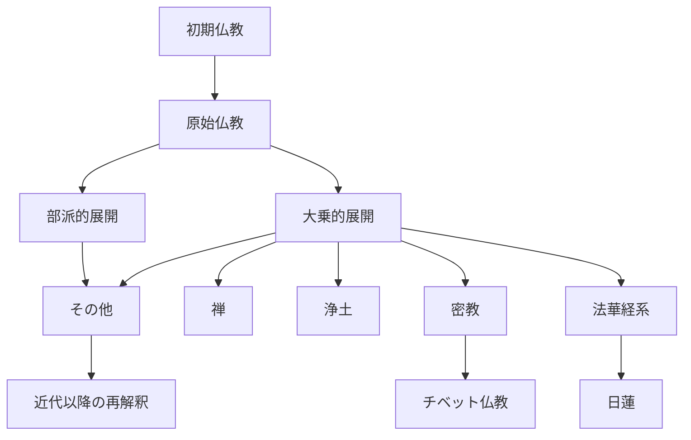

# 仏教 歴史年表と分岐比較

このファイルは、`仏教` 配下の分類を「時系列」「分岐」「比較」の3視点で横断するための整理ノートです。

## 1. 歴史年表（分類対応）

| 時期 | 主な展開 | 分岐のポイント | 対応フォルダ |
| --- | --- | --- | --- |
| 紀元前5世紀ごろ | 釈尊の教えが成立 | 苦・縁起・無我・八正道 | `原始仏教` |
| 紀元前3世紀〜紀元1世紀 | 部派展開と教説整理 | 教理の精緻化・阿毘達磨的整理 | `原始仏教` `その他` |
| 1〜5世紀 | 大乗の展開 | 菩薩道・空・慈悲の強調 | `その他` |
| 4〜8世紀 | 密教化 | 儀礼・曼荼羅・真言の体系化 | `密教` |
| 6〜9世紀 | 禅の形成 | 不立文字・坐禅・公案の重視 | `禅` |
| 6〜13世紀 | 浄土思想の深化 | 他力・念仏・往生信仰の展開 | `浄土` |
| 13世紀 | 日蓮思想の形成 | 法華経中心・題目実践 | `日蓮` |
| 11〜17世紀 | チベット展開 | 密教と論理学・僧院制度の統合 | `チベット仏教` |
| 19〜21世紀 | 近代再編・グローバル化 | 実践の再解釈・比較思想化 | `その他` |

## 2. 分岐マップ（Mermaid）

## 3. 主要分岐の比較

| 系統 | 中心目標 | 主な実践 | 特徴的な立場 | 接続しやすい系統 |
| --- | --- | --- | --- | --- |
| 原始仏教 | 苦の止滅と解脱 | 戒・定・慧、四諦・八正道 | 実践と教説の基礎が明確 | 禅・浄土・密教の基盤 |
| 禅 | 直接的な覚りの体得 | 坐禅、公案、作務 | 言語化より体験を重視 | 原始仏教・密教 |
| 浄土 | 凡夫救済と往生 | 念仏、信願 | 他力への信を中核化 | 日蓮・大乗一般 |
| 密教 | 即身成仏の実現 | 真言、印契、曼荼羅、灌頂 | 象徴儀礼と宇宙観の統合 | チベット仏教・禅 |
| 日蓮 | 末法における実践確立 | 題目、法華経読解 | 法華経中心と社会実践の接続 | 浄土・その他 |
| チベット仏教 | 菩薩道と密教実践の統合 | 次第道、タントラ、論理学習 | 学問体系と実践体系の両立 | 密教・原始仏教 |

## 4. 比較するときの軸（おすすめ）

1. 救済観: 自力か他力か、段階修行か即時性か
2. 実践観: 瞑想中心か、儀礼中心か、信中心か
3. 言語観: 教義説明重視か、言語を超える体験重視か
4. 社会観: 出世間重視か、社会変革・布教実践を重視するか
