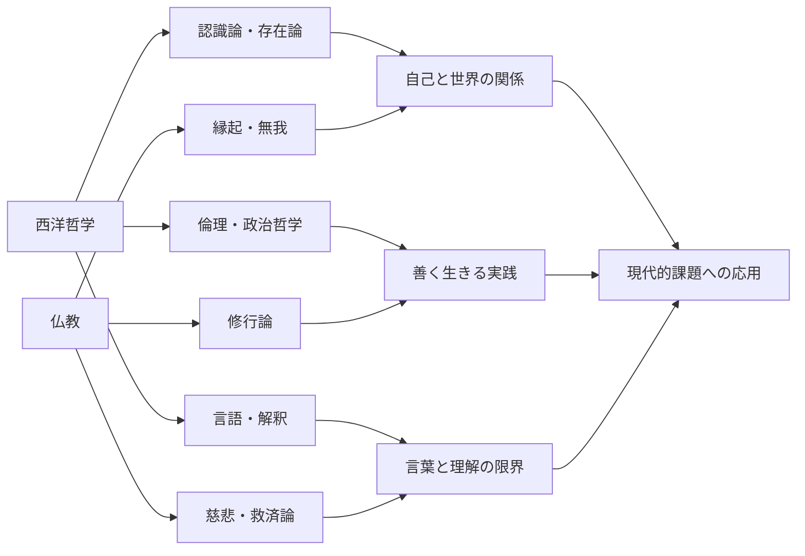

# 哲学横断比較マップ（西洋哲学 × 仏教）

このファイルは、`西洋哲学` と `仏教` を同じ比較軸で読むための入口です。

- 西洋側詳細: `西洋哲学/歴史年表と分岐比較.md`
- 仏教側詳細: `仏教/歴史年表と分岐比較.md`

## 1. 横断マップ（Mermaid）

## 2. 比較表（最小セット）

| 比較軸 | 西洋哲学（主な問い） | 仏教（主な問い） | 交差ポイント |
| --- | --- | --- | --- |
| 自己観 | 自由意志・主体・同一性 | 無我・縁起・執着 | 「自己は固定か関係的か」 |
| 認識 | 真理の基礎づけ（理性/経験/言語） | 無明の克服と正見 | 認識の誤りをどう正すか |
| 倫理 | 義務・結果・徳の比較 | 苦の軽減と慈悲の実践 | 行為評価と実践修養の接続 |
| 社会 | 正義・制度・権力 | 僧団・在家倫理・社会関与 | 個人修養と社会制度の往復 |
| 実践 | 論証・批判・制度設計 | 瞑想・戒律・念仏・儀礼 | 理論と実践をどう循環させるか |

## 3. 使い方

1. まず各系統の分岐図を読む
2. 次に比較表の1軸だけ選んでノート化する
3. 具体人物を1人ずつ対応させる（例: カント × 原始仏教、サルトル × 禅）
4. 最後に「自分の人生哲学にどう接続するか」を1段落で書く
