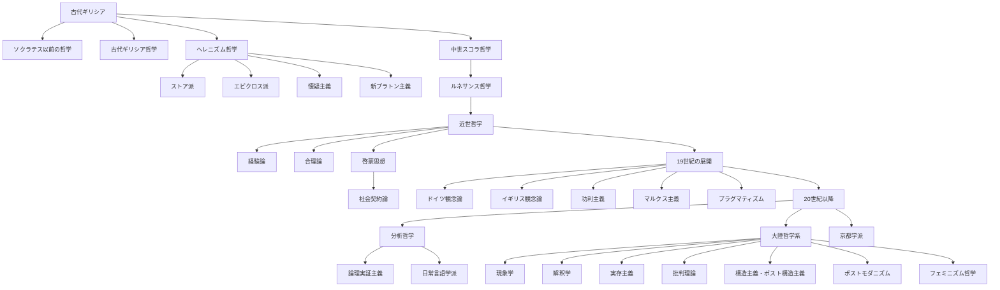

# 西洋哲学 歴史年表と分岐比較

このファイルは、`西洋哲学` 配下の分類を「時系列」「分岐」「比較」の3視点で一気に把握するための索引です。

## 1. 歴史年表（分類対応）

| 時期 | 中心テーマ | 主な分岐 | 対応フォルダ |
| --- | --- | --- | --- |
| 紀元前6〜4世紀 | 世界の始原・存在・徳 | 前ソクラテス系 / 古典期 | `ソクラテス以前の哲学` `古代ギリシア哲学` |
| 紀元前3世紀〜紀元3世紀 | 生の技法と平静 | ストア派 / エピクロス派 / 懐疑主義 / 新プラトン主義 | `ストア派` `エピクロス派` `懐疑主義` `新プラトン主義` `ヘレニズム哲学` |
| 5〜14世紀 | 信仰と理性の統合 | スコラ学 | `中世スコラ哲学` |
| 15〜16世紀 | 人文主義と近代化準備 | ルネサンス思想 | `ルネサンス哲学` |
| 17〜18世紀 | 知識の基礎づけ | 経験論 / 合理論 / 啓蒙 / 社会契約 | `経験論` `合理論` `啓蒙思想` `社会契約論` |
| 19世紀 | 歴史・社会・主体の再編 | 観念論 / 功利主義 / マルクス主義 / プラグマティズム | `ドイツ観念論` `イギリス観念論` `功利主義` `マルクス主義` `プラグマティズム` |
| 20世紀以降 | 言語・存在・権力の再検討 | 分析哲学系 / 大陸哲学系 / フェミニズム | `分析哲学` `論理実証主義` `日常言語学派` `現象学` `解釈学` `実存主義` `批判理論` `構造主義・ポスト構造主義` `ポストモダニズム` `フェミニズム哲学` |

## 2. 分岐マップ（Mermaid）

## 3. 主要分岐の比較

| 分岐 | 中心問い | 方法 | 強み | つながりやすい分岐 |
| --- | --- | --- | --- | --- |
| 経験論 | 知識はどこから来るか | 観察・経験の分析 | 科学的方法と親和性が高い | 分析哲学・プラグマティズム |
| 合理論 | 確実な知はいかに可能か | 演繹・原理推論 | 体系的で厳密な構築 | ドイツ観念論・数学哲学 |
| 功利主義 | 何が善い行為か | 結果評価（幸福） | 制度設計・政策評価に強い | 社会契約論・分析倫理学 |
| マルクス主義 | 社会はどう変わるか | 歴史・経済・階級分析 | 構造批判と変革志向 | 批判理論・政治哲学 |
| 分析哲学 | 概念はどう明確化できるか | 論理・言語分析 | 議論の精密化 | 論理実証主義・日常言語学派 |
| 現象学・実存主義 | 生きられた経験とは何か | 記述・解釈・実存分析 | 主体経験の厚みを捉える | 解釈学・心理学・倫理学 |
| ポスト構造主義・ポストモダニズム | 権力と言説はどう働くか | 系譜学・脱構築 | 権力批判・制度批判 | フェミニズム哲学・批判理論 |

## 4. 読み進め方（短縮版）

1. 古代の2本柱を押さえる: `ソクラテス以前の哲学` と `古代ギリシア哲学`
2. 近世の対立軸を理解する: `経験論` と `合理論`
3. 現代の2系統を往復する: `分析哲学` と `大陸系（現象学〜ポストモダニズム）`
4. 観点を固定して比較する: 認識論・倫理・政治・主体の4軸で表に落とす
